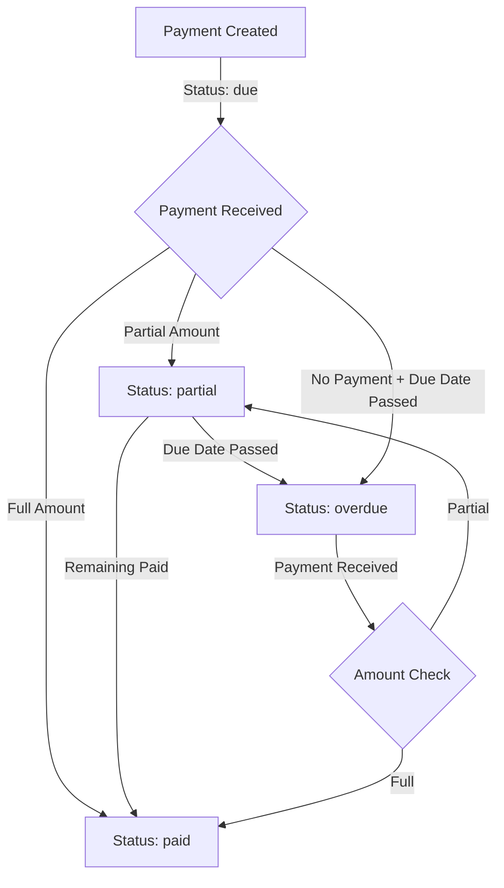

# Payment System - Complete Guide

## Overview

Battery Beacon Connect implements a **sophisticated payment management system** that handles multiple payment types, automated calculations, credit management, and intelligent payment distribution. The system is designed to handle complex scenarios like partial payments, overpayments, pro-rated charges, and overdue management.

## Payment Types

The system supports three distinct payment models, each with its own workflow and characteristics:

### 1. EMI (Equated Monthly Installment)

**Purpose**: Enables customers to purchase batteries through installment payments

**How It Works**:
```
Customer Agreement:
├── Total Battery Cost: ₹30,000
├── Down Payment: ₹5,000
├── Financing Amount: ₹25,000
├── EMI Tenure: 12 months
└── Monthly EMI: ₹2,083.33
```

**Workflow**:
1. Customer makes down payment
2. System calculates remaining amount
3. EMI schedule automatically generated
4. Each EMI has a due date (5 days after assignment + n months)
5. Customer makes monthly payments
6. Upon completion, customer owns the battery

**EMI Record Structure**:
```typescript
interface EMI {
  id: string;
  customer_id: string;
  emi_number: number;           // 1, 2, 3, ..., 12
  total_emi_count: number;      // 12
  amount: number;                // ₹2,083.33
  due_date: string;              // '2025-02-05'
  payment_status: 'due' | 'paid' | 'partial' | 'overdue';
  paid_amount: number;           // 0 to amount
  remaining_amount: number;      // amount - paid_amount
}
```

**EMI Generation Logic**:
```typescript
// Example EMI schedule for 12-month plan
Assignment Date: January 1, 2025
EMI Start Date: January 1, 2025

EMI 1: Due on January 6, 2025   (5 days after start)
EMI 2: Due on February 6, 2025  (1 month + 5 days)
EMI 3: Due on March 6, 2025     (2 months + 5 days)
...
EMI 12: Due on December 6, 2025 (11 months + 5 days)
```

**Status Transitions**:
```
due → partial (when amount < remaining)
due → paid (when amount = remaining)
due → overdue (when due_date < today && not paid)
partial → paid (when remaining = 0)
partial → overdue (when due_date < today && not paid)
```

### 2. Monthly Rent

**Purpose**: Customers rent batteries on a monthly subscription basis

**How It Works**:
```
Rental Agreement:
├── Monthly Rent: ₹1,500/month
├── Security Deposit: ₹3,000 (one-time)
├── Billing Cycle: 1st of every month
├── Due Date: 5th of every month
└── Duration: Ongoing (no end date)
```

**Workflow**:
1. Customer pays security deposit
2. System generates monthly rent charges
3. Charges created at start of each month
4. Customer pays by 5th of each month
5. Continues monthly until contract ends
6. Security deposit returned on battery return

**Monthly Rent Record Structure**:
```typescript
interface MonthlyRent {
  id: string;
  customer_id: string;
  rent_month: string;            // '2025-01-01'
  amount: number;                // ₹1,500
  due_date: string;              // '2025-01-05'
  payment_status: 'due' | 'paid' | 'partial' | 'overdue';
  paid_amount: number;
  remaining_amount: number;
  is_prorated?: boolean;         // For mid-month starts
  prorated_days?: number;
  daily_rate?: number;
}
```

**Pro-Rated Rent Calculation**:

When a customer joins mid-month, the first rent is pro-rated:

```typescript
// Example: Customer joins on January 15, 2025
Monthly Rent: ₹1,500
Days in January: 31
Days remaining: 17 (from 15th to 31st)

Pro-rated Amount = (₹1,500 / 31) × 17 = ₹822.58

First bill: ₹822.58 (pro-rated)
Next bill: ₹1,500 (full month from February 1)
```

**Automated Monthly Generation**:

The system has a scheduled job that runs on the 1st of every month:

```sql
-- Database function: generate_monthly_rent_charges()
-- Runs: 1st of every month at 00:00
-- Action: Creates rent charges for all active rental customers
```

### 3. One-Time Purchase

**Purpose**: Customer buys battery outright with full payment

**How It Works**:
```
Purchase Transaction:
├── Battery Cost: ₹25,000
├── Payment: ₹25,000 (full amount)
├── Ownership: Immediate
└── No recurring charges
```

**Workflow**:
1. Customer pays full amount
2. Single transaction recorded
3. Battery ownership transferred
4. No EMIs or monthly rents
5. No further payments

---

## Payment Cycle Details

### Due Date Calculation

All payments follow a consistent due date pattern:

```typescript
// EMI Due Date
Assignment Date: Day X
EMI Start Date: Day X
EMI n Due Date: (EMI Start Date + n months + 5 days)

// Monthly Rent Due Date
Rent Month Start: 1st of month
Rent Due Date: 5th of month
Grace Period: None (overdue on 6th)
```

### Payment Status Flow



### Overdue Management

**Automated Overdue Detection**:

The system runs a scheduled job to update payment statuses:

```typescript
// Runs: Daily at 00:00
// Function: update_overdue_status()

// Logic:
FOR each EMI/Rent:
  IF due_date < current_date AND status IN ('due', 'partial'):
    UPDATE status = 'overdue'
```

**Overdue Days Calculation**:
```typescript
Overdue Days = Current Date - Due Date

Example:
Due Date: January 5, 2025
Current Date: January 15, 2025
Overdue Days: 10 days
```

---

## Payment Processing System

### Payment Distribution Algorithm

When a payment is received, the system intelligently distributes it:

**Priority Order**:
1. **Overdue Payments** (oldest first)
2. **Due Payments** (by due date)
3. **Future Payments** (by due date)
4. **Excess → Customer Credit**

**Algorithm Flow**:

```typescript
function distributePayment(
  paymentAmount: number,
  emis: EMI[],
  rents: MonthlyRent[],
  paymentType: 'emi' | 'rent' | 'auto'
): PaymentDistribution {
  
  let remainingAmount = paymentAmount;
  const emiPayments = [];
  const rentPayments = [];

  // Step 1: Get unpaid items based on payment type
  const unpaidItems = paymentType === 'emi' 
    ? emis.filter(e => e.payment_status !== 'paid')
    : paymentType === 'rent'
    ? rents.filter(r => r.payment_status !== 'paid')
    : [...emis, ...rents].filter(i => i.payment_status !== 'paid');

  // Step 2: Sort by priority (overdue first, then by due date)
  unpaidItems.sort((a, b) => {
    if (a.payment_status === 'overdue' && b.payment_status !== 'overdue') return -1;
    if (a.payment_status !== 'overdue' && b.payment_status === 'overdue') return 1;
    return new Date(a.due_date) - new Date(b.due_date);
  });

  // Step 3: Distribute payment
  for (const item of unpaidItems) {
    if (remainingAmount <= 0) break;

    const amountToPay = Math.min(remainingAmount, item.remaining_amount);
    const newPaidAmount = item.paid_amount + amountToPay;
    const newRemainingAmount = item.remaining_amount - amountToPay;
    const newStatus = newRemainingAmount === 0 
      ? 'paid' 
      : (newPaidAmount > 0 ? 'partial' : item.payment_status);

    if (item.type === 'emi') {
      emiPayments.push({
        emiId: item.id,
        emiNumber: item.emi_number,
        amount: amountToPay,
        newPaidAmount,
        newRemainingAmount,
        newStatus
      });
    } else {
      rentPayments.push({
        rentId: item.id,
        rentMonth: item.rent_month,
        amount: amountToPay,
        newPaidAmount,
        newRemainingAmount,
        newStatus
      });
    }

    remainingAmount -= amountToPay;
  }

  // Step 4: Handle excess as credit
  return {
    emiPayments,
    rentPayments,
    excessAmount: remainingAmount,
    totalProcessed: paymentAmount - remainingAmount
  };
}
```

### Payment Processing Example

**Scenario**:
- Customer has 3 overdue EMIs: ₹2,000 each
- Customer has 1 due EMI: ₹2,000
- Customer pays: ₹7,500

**Processing**:

```
Step 1: Apply to EMI #1 (overdue)
  Amount: ₹2,000
  Remaining: ₹5,500
  Status: EMI #1 → paid

Step 2: Apply to EMI #2 (overdue)
  Amount: ₹2,000
  Remaining: ₹3,500
  Status: EMI #2 → paid

Step 3: Apply to EMI #3 (overdue)
  Amount: ₹2,000
  Remaining: ₹1,500
  Status: EMI #3 → paid

Step 4: Apply to EMI #4 (due)
  Amount: ₹1,500
  Remaining: ₹0
  Status: EMI #4 → partial (₹1,500 paid, ₹500 remaining)

Result:
  ✓ 3 EMIs fully paid
  ✓ 1 EMI partially paid
  ✓ No excess credit
```

---

## Credit Management System

### Customer Credit Balance

**Purpose**: Track excess payments and allow future application

**How Credits Work**:

```typescript
interface CustomerCredit {
  id: string;
  customer_id: string;
  credit_balance: number;      // Current available credit
  updated_at: string;
}
```

**Credit Sources**:
1. **Overpayment**: Customer pays more than total due
2. **Refunds**: Returned security deposits
3. **Adjustments**: Manual credit additions by partner/admin
4. **Promotions**: Bonus credits

**Credit Usage**:
```typescript
// Credits automatically applied in future payments
Payment Amount: ₹5,000
Available Credit: ₹1,000

System Action:
  1. Apply ₹1,000 from credit
  2. Charge customer ₹4,000
  3. Credit balance → ₹0
  4. Total applied to dues: ₹5,000
```

### Credit Transaction Tracking

All credit operations are logged:

```typescript
// Transaction record for credit addition
{
  transaction_type: 'deposit',
  amount: excess_amount,
  credit_added: excess_amount,
  remarks: 'Credit added from excess payment'
}

// Transaction record for credit usage
{
  transaction_type: 'payment',
  amount: payment_amount,
  credit_used: credit_applied,
  remarks: 'Used ₹1,000 credit balance'
}
```

---

## Transaction Management

### Transaction Record

Every payment creates a transaction:

```typescript
interface Transaction {
  id: string;
  customer_id: string;
  partner_id: string;
  battery_id?: string;
  transaction_type: 'emi' | 'rent' | 'purchase' | 'maintenance' | 'deposit';
  amount: number;
  payment_status: 'paid' | 'partial' | 'due' | 'overdue';
  transaction_date: string;      // When payment was made
  due_date?: string;             // Original due date
  emi_id?: string;               // If EMI payment
  monthly_rent_id?: string;      // If rent payment
  credit_used?: number;
  credit_added?: number;
  remarks?: string;
}
```

### Transaction Types

1. **EMI Payment**
   ```typescript
   {
     transaction_type: 'emi',
     amount: 2000,
     emi_id: 'emi-123',
     remarks: 'EMI 3 payment - paid'
   }
   ```

2. **Rent Payment**
   ```typescript
   {
     transaction_type: 'rent',
     amount: 1500,
     monthly_rent_id: 'rent-456',
     remarks: 'Rent payment for January 2025 - paid'
   }
   ```

3. **Purchase**
   ```typescript
   {
     transaction_type: 'purchase',
     amount: 25000,
     remarks: 'One-time battery purchase'
   }
   ```

4. **Deposit**
   ```typescript
   {
     transaction_type: 'deposit',
     amount: 3000,
     remarks: 'Security deposit'
   }
   ```

5. **Credit Addition**
   ```typescript
   {
     transaction_type: 'deposit',
     amount: 500,
     credit_added: 500,
     remarks: 'Credit added from excess payment'
   }
   ```

---

## Payment Ledger (Planned)

**Note**: The payment_ledger table is not currently implemented but is designed for future use.

### Purpose
The payment ledger will provide a detailed chronological record of all payment activities:

```typescript
interface PaymentLedger {
  id: string;
  customer_id: string;
  transaction_id: string;
  payment_date: string;
  amount_paid: number;
  payment_mode: 'cash' | 'upi' | 'bank_transfer' | 'cheque' | 'card';
  payment_status: 'paid' | 'partial' | 'due' | 'overdue';
  remaining_balance: number;      // Total outstanding after payment
  applicable_month?: string;      // For rent
  emi_number?: number;            // For EMI
  emi_id?: string;
  rent_id?: string;
  remarks?: string;
}
```

### Planned Features
- Complete payment audit trail
- Balance snapshots at each payment
- Payment method tracking
- Remarks and notes
- Dispute management
- Refund tracking

---

## Payment Processing Service

### BillingService Class

The system uses a centralized `BillingService` for all payment operations:

```typescript
class BillingService {
  // Calculate how payment should be distributed
  static async calculatePaymentDistribution(
    customerId: string,
    paymentAmount: number,
    paymentType: 'emi' | 'rent' | 'auto'
  ): Promise<PaymentCalculationResult>

  // Process a payment end-to-end
  static async processPayment(
    customerId: string,
    paymentAmount: number,
    paymentType: 'emi' | 'rent' | 'auto',
    paymentMode: PaymentMode,
    remarks?: string,
    customPaymentDate?: string
  ): Promise<PaymentResult>

  // Generate EMI schedule for a customer
  static async generateEMISchedule(
    customerId: string,
    totalAmount: number,
    downPayment: number,
    emiCount: number,
    assignmentDate: string
  ): Promise<Result>

  // Generate rent schedule for a customer
  static async generateRentSchedule(
    customerId: string,
    monthlyRent: number,
    joinDate: string,
    months: number
  ): Promise<Result>

  // Generate pro-rated first rent
  static async generateProRatedRent(
    customerId: string
  ): Promise<Result>

  // Update payment statuses for a customer
  static async updatePaymentStatuses(
    customerId: string
  ): Promise<Result>

  // Get comprehensive billing summary
  static async getBillingSummary(
    customerId: string
  ): Promise<BillingDetails>
}
```

### Payment Processing Workflow

```typescript
// Example: Process a ₹5,000 payment
const result = await BillingService.processPayment(
  customerId: 'customer-123',
  paymentAmount: 5000,
  paymentType: 'auto',
  paymentMode: 'upi',
  remarks: 'Payment via UPI'
);

// System performs:
1. Calculates payment distribution
2. Updates EMI/rent records
3. Creates transaction entries
4. Handles excess as credit
5. Updates payment statuses
6. Returns detailed result
```

---

## Automated Jobs

### Monthly Rent Generation

**Schedule**: 1st of every month at 00:00

```sql
-- Function: generate_monthly_rent_charges()
-- Action: Create rent charges for active rental customers

FOR EACH customer WHERE payment_type = 'monthly_rent' AND status = 'active':
  IF no rent exists for current month:
    INSERT INTO monthly_rents (
      customer_id,
      rent_month: current_month,
      amount: customer.monthly_rent,
      due_date: current_month + 4 days,
      remaining_amount: customer.monthly_rent,
      payment_status: 'due'
    );
```

### Overdue Status Update

**Schedule**: Daily at 00:00

```sql
-- Function: update_overdue_status()
-- Action: Mark overdue EMIs and rents

UPDATE emis 
SET payment_status = 'overdue'
WHERE due_date < CURRENT_DATE 
  AND payment_status IN ('due', 'partial');

UPDATE monthly_rents 
SET payment_status = 'overdue'
WHERE due_date < CURRENT_DATE 
  AND payment_status IN ('due', 'partial');
```

---

## Payment Modes

The system supports multiple payment methods:

```typescript
type PaymentMode = 
  | 'cash'           // Physical cash payment
  | 'upi'            // UPI payments (GPay, PhonePe, Paytm)
  | 'bank_transfer'  // NEFT/RTGS/IMPS
  | 'cheque'         // Cheque payments
  | 'card';          // Credit/Debit card
```

**Tracking**:
- Every transaction records payment mode
- Useful for reconciliation
- Payment method analytics
- Settlement tracking

---

## Payment Calculations Utility

### PaymentCalculations Class

Provides utility functions for payment math:

```typescript
class PaymentCalculations {
  // Distribute payment across EMIs/rents
  static distributePayment(
    paymentAmount: number,
    emis: EMI[],
    rents: MonthlyRent[],
    paymentType: 'emi' | 'rent' | 'auto'
  ): PaymentCalculationResult

  // Calculate EMI status
  static calculateEMIStatus(emi: EMI): PaymentStatus

  // Calculate rent status
  static calculateRentStatus(rent: MonthlyRent): PaymentStatus

  // Generate EMI schedule
  static generateEMISchedule(
    customerId: string,
    totalAmount: number,
    downPayment: number,
    emiCount: number,
    assignmentDate: string
  ): EMI[]

  // Generate rent schedule
  static generateRentSchedule(
    customerId: string,
    monthlyRent: number,
    joinDate: string,
    months: number
  ): MonthlyRent[]

  // Calculate pro-rated rent
  static calculateProRatedRent(
    monthlyRent: number,
    joinDate: string
  ): { amount: number; days: number; dailyRate: number }

  // Calculate total paid
  static calculateTotalPaid(
    emis: EMI[],
    rents: MonthlyRent[]
  ): number

  // Calculate total outstanding
  static calculateTotalOutstanding(
    emis: EMI[],
    rents: MonthlyRent[]
  ): number

  // Calculate overdue amount
  static calculateOverdueAmount(
    emis: EMI[],
    rents: MonthlyRent[]
  ): number

  // Calculate next due date
  static calculateNextDueDate(
    emis: EMI[],
    rents: MonthlyRent[]
  ): string | null
}
```

---

## Financial Reporting

### Customer-Level Reports

**Billing Summary**:
```typescript
{
  emis: EMI[];                    // All EMIs for customer
  rents: MonthlyRent[];          // All rents for customer
  credits: CustomerCredit;       // Credit balance
  transactions: Transaction[];   // Payment history
  totalPaid: number;             // Total amount paid
  totalDue: number;              // Total amount outstanding
  overdueAmount: number;         // Total overdue
  nextDueDate: string | null;    // Next payment due
  emiProgress?: {                // EMI completion status
    paid: number;
    total: number;
    percentage: number;
  }
}
```

### Partner-Level Reports

- Total customers
- Active customers
- Total revenue collected
- Pending payments
- Overdue customers
- Payment collection rate

### Admin-Level Reports

- System-wide revenue
- Partner-wise performance
- Payment collection trends
- Overdue analytics
- Customer acquisition
- Battery utilization

---

## Best Practices

### For Partners

1. **Regular Payment Collection**
   - Collect payments before due date
   - Follow up on due dates
   - Record payments immediately

2. **Overdue Management**
   - Contact customers on overdue
   - Offer payment plans if needed
   - Document all communications

3. **Documentation**
   - Add remarks to all transactions
   - Note payment mode
   - Track partial payments

### For System Administrators

1. **Monitor Automated Jobs**
   - Verify monthly rent generation
   - Check overdue updates
   - Review job logs

2. **Data Integrity**
   - Regular database backups
   - Verify payment calculations
   - Audit credit balances

3. **Performance Optimization**
   - Index on due_date columns
   - Archive old transactions
   - Optimize query performance

---

## Future Enhancements

### Planned Features

1. **Automated Reminders**
   - SMS reminders before due date
   - Email notifications
   - WhatsApp integration

2. **Payment Gateway Integration**
   - Online payment collection
   - Auto-payment setup
   - Instant payment confirmation

3. **Advanced Analytics**
   - Predictive overdue detection
   - Payment behavior analysis
   - Revenue forecasting

4. **Customer Portal**
   - Self-service payment
   - View payment history
   - Download receipts

5. **Penalty System**
   - Late payment charges
   - Configurable penalty rates
   - Automatic penalty calculation

6. **Payment Plans**
   - Custom payment schedules
   - Deferred payments
   - Flexible EMI terms
