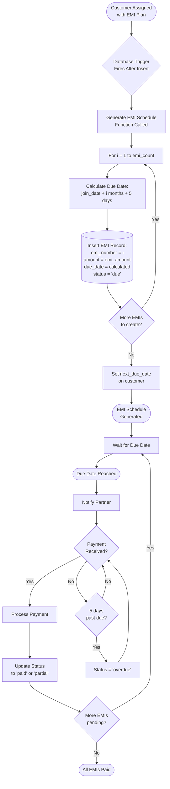

# Visual Workflow Diagrams

This document contains comprehensive Mermaid diagrams illustrating all major workflows in the Battery Beacon Connect system.

## Table of Contents
1. [User Authentication Flow](#user-authentication-flow)
2. [Partner Management Flow](#partner-management-flow)
3. [Customer Onboarding Flow](#customer-onboarding-flow)
4. [Battery Lifecycle Flow](#battery-lifecycle-flow)
5. [Payment Processing Flow](#payment-processing-flow)
6. [EMI Payment Journey](#emi-payment-journey)
7. [Monthly Rent Cycle](#monthly-rent-cycle)
8. [Overdue Management Flow](#overdue-management-flow)
9. [Credit System Flow](#credit-system-flow)
10. [Data Access Flow (RLS)](#data-access-flow-rls)

---

## User Authentication Flow


### Session Management Flow


---

## Partner Management Flow


### Partner Profile Management


---

## Customer Onboarding Flow

### Complete Customer Creation Journey


### Document Upload Detail


---

## Battery Lifecycle Flow


### Battery Status Update Trigger Flow

```mermaid
flowchart TD
    Event([Battery Record<br/>Updated]) --> Trigger{Database Trigger<br/>Fires}
    Trigger --> CheckPartner{partner_id<br/>NULL?}
    CheckPartner -->|Yes| SetAvailable1[Status = 'available']
    CheckPartner -->|No| CheckCustomer{customer_id<br/>NULL?}
    CheckCustomer -->|Yes| SetAvailable2[Status = 'available']
    CheckCustomer -->|No| SetAssigned[Status = 'assigned']
    SetAvailable1 --> UpdateTimestamp
    SetAvailable2 --> UpdateTimestamp
    SetAssigned --> UpdateTimestamp
    UpdateTimestamp[Set updated_at<br/>= now()] --> Return([Return Updated<br/>Record])
```

---

## Payment Processing Flow

### Comprehensive Payment Distribution


### Payment Status Calculation


---

## EMI Payment Journey



### EMI Status State Machine


---

## Monthly Rent Cycle


### Monthly Rent Status Flow


---

## Overdue Management Flow


### Overdue Detection Logic


---

## Credit System Flow


### Credit Usage Flow

```mermaid
flowchart TD
    Start([New Payment Due]) --> CheckCredit{Customer Has<br/>Credit Balance?}
    CheckCredit -->|No| NormalPayment[Process Normal<br/>Payment Flow]
    CheckCredit -->|Yes| AskUse{Partner Chooses<br/>to Use Credit?}
    
    AskUse -->|No| NormalPayment
    AskUse -->|Yes| FetchBalance[(Get credit_balance)]
    FetchBalance --> CalcUse[Calculate:<br/>credit_to_use = min(balance, due_amount)]
    CalcUse --> ApplyCredit[Apply Credit<br/>to Payment]
    ApplyCredit --> UpdateBalance[(UPDATE credit_balance:<br/>balance - credit_used)]
    UpdateBalance --> RecordUsage[(INSERT transaction:<br/>type = 'credit_used'<br/>credit_used = amount)]
    RecordUsage --> CheckRemaining{Remaining<br/>Amount Due?}
    CheckRemaining -->|Yes| CollectCash[Collect Remaining<br/>in Cash]
    CheckRemaining -->|No| Complete
    CollectCash --> Complete[Payment Complete]
    NormalPayment --> Complete
    Complete --> End([Payment Processed])
```

### Credit Balance Tracking


---

## Data Access Flow (RLS)

### Row Level Security Policy Evaluation


### Security Definer Function Flow

```mermaid
sequenceDiagram
    participant User
    participant RLS as RLS Policy
    participant Func as Security Definer<br/>Function
    participant Table as user_roles Table
    participant Result

    User->>RLS: Request access to data
    RLS->>Func: Call has_role(user_id, 'admin')
    Note over Func: Function executes with<br/>SECURITY DEFINER privileges
    Func->>Table: Query user_roles directly<br/>(bypasses RLS)
    Table-->>Func: Return role data
    Func->>Func: Check if user has role
    Func-->>RLS: Return boolean result
    
    alt User Has Role
        RLS-->>User: Grant access
        RLS->>Result: Return requested data
        Result-->>User: Data returned
    else User Doesn't Have Role
        RLS-->>User: Deny access
    end
```

### Partner Data Isolation

```mermaid
flowchart TD
    Partner([Partner Logs In]) --> GetID[Get partner_id<br/>from auth context]
    GetID --> QueryBatteries[(Query Batteries Table)]
    QueryBatteries --> RLS1{RLS Policy:<br/>partner_id = auth.uid<br/>OR is_admin?}
    RLS1 -->|True| FilterBatteries[Return Only<br/>Partner's Batteries]
    RLS1 -->|False| Empty1[Return Empty Set]
    
    FilterBatteries --> QueryCustomers
    Empty1 --> QueryCustomers
    
    QueryCustomers[(Query Customers Table)] --> RLS2{RLS Policy:<br/>partner_id = auth.uid<br/>OR is_admin?}
    RLS2 -->|True| FilterCustomers[Return Only<br/>Partner's Customers]
    RLS2 -->|False| Empty2[Return Empty Set]
    
    FilterCustomers --> Display
    Empty2 --> Display
    Display[Display Dashboard<br/>with Filtered Data] --> End([Partner Sees<br/>Only Own Data])
```

### Admin Access Flow

```mermaid
flowchart TD
    Admin([Admin Logs In]) --> CheckRole{Verify<br/>is_admin()}
    CheckRole -->|True| FullAccess[Grant Full Access]
    CheckRole -->|False| PartnerAccess[Fallback to<br/>Partner Permissions]
    
    FullAccess --> QueryAll[(Query Any Table)]
    QueryAll --> RLS{RLS Policy:<br/>is_admin?}
    RLS -->|True| Bypass[Bypass Partner<br/>Restrictions]
    Bypass --> ReturnAll[Return All Data<br/>From All Partners]
    ReturnAll --> Display[Display Complete<br/>System View]
    Display --> End([Admin Sees<br/>Everything])
    
    PartnerAccess --> End
```

---

## Complete System Flow

```mermaid
flowchart TD
    Start([System Start]) --> Auth[User Authentication]
    Auth --> Dashboard{User Role?}
    Dashboard -->|Admin| AdminFlow
    Dashboard -->|Partner| PartnerFlow
    
    AdminFlow[Admin Dashboard] --> AdminActions{Admin Action}
    AdminActions -->|Manage Partners| PartnerCRUD
    AdminActions -->|View All Data| AllData
    AdminActions -->|Run Reports| Reports
    AdminActions -->|Manage Scheduler| Scheduler
    
    PartnerFlow[Partner Dashboard] --> PartnerActions{Partner Action}
    PartnerActions -->|Manage Batteries| BatteryCRUD
    PartnerActions -->|Manage Customers| CustomerCRUD
    PartnerActions -->|Process Payments| PaymentFlow
    PartnerActions -->|View Billing| BillingDash
    
    PartnerCRUD[Create/Edit/Delete<br/>Partners] --> AdminFlow
    AllData[View All Partners<br/>Batteries, Customers] --> AdminFlow
    Reports[Generate System<br/>Reports] --> AdminFlow
    Scheduler[Configure Automated<br/>Jobs] --> AdminFlow
    
    BatteryCRUD[Add/Edit/Assign<br/>Batteries] --> PartnerFlow
    CustomerCRUD[Add/Edit<br/>Customers] --> PartnerFlow
    PaymentFlow[Process Customer<br/>Payments] --> PartnerFlow
    BillingDash[View Customer<br/>Billing] --> PartnerFlow
    
    AdminFlow --> BackgroundJobs
    PartnerFlow --> BackgroundJobs
    
    BackgroundJobs[Automated Jobs] --> DailyJobs{Daily Jobs}
    DailyJobs --> UpdateOverdue[Update Overdue<br/>Status]
    
    BackgroundJobs --> MonthlyJobs{Monthly Jobs}
    MonthlyJobs --> GenerateRent[Generate Monthly<br/>Rent Charges]
    
    UpdateOverdue --> BackgroundJobs
    GenerateRent --> BackgroundJobs
    
    BackgroundJobs --> End([System Running])
```

---

This comprehensive set of diagrams illustrates all major workflows in the Battery Beacon Connect system. Each diagram can be rendered using Mermaid in documentation tools or IDEs that support Mermaid syntax.
